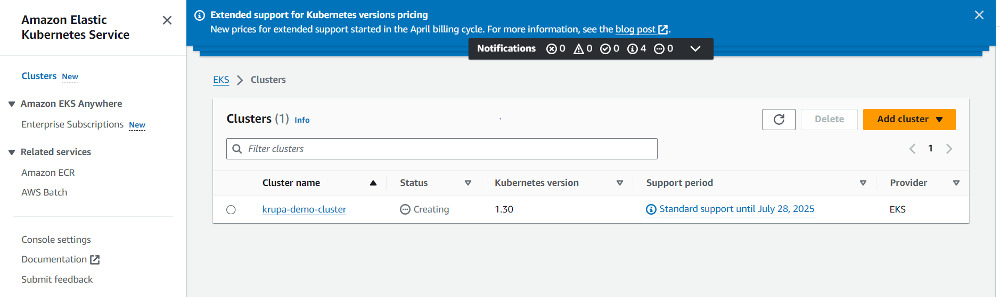
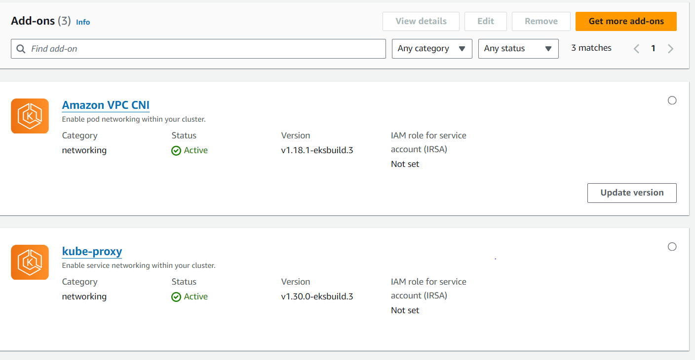
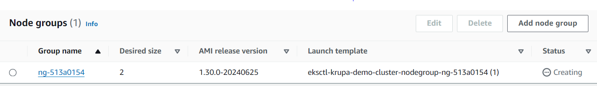
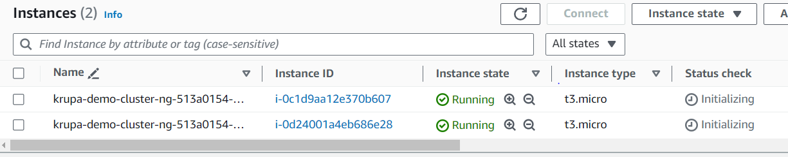

# build-with-docker

# Steps I followed to build an Image and Push to ECR

- Create a Dockerfile
- write the Build Instructions
- make sure your html files are in the same directory as your Dockerfile(Build Context)
- command to build : `docker build -t krupa-web-app .`
- Tag this image to your accountname/repository name: `docker tag krupa-web-app:latest 975050204585.dkr.ecr.us-east-1.amazonaws.com/krupa-web-app:latest`
- once tagged, if you try to push the image, it fails because you're not authenticated to push to ECR.
- to login to ECR ` aws ecr get-login-password | docker login -u AWS --password-stdin "https://$(aws sts get-caller-identity --query 'Account' --output text).dkr.ecr.us-east-1.amazonaws.com`
- in order to successfully login to ECR using above command, you have to set up local AWS CLI and configure with AWS IAM user Access Keys.
- Push Command `docker push 975050204585.dkr.ecr.us-east-1.amazonaws.com/krupa-web-app:latest`

# issues I faced during this 

- when I update my webpage and rebuild image, the new changes were not reflected in the new image as the docker caches layers.
- To ensure that your Docker image is always built with the latest version of your webpage files, you can use a strategy that forces Docker to invalidate the cache for those specific files.
- command I used to invalidate cache `docker build --no-cache -t krupa-web-app:no-cache .`

# Working with Kubernetes:

## Spinning up a K8S Cluster EKS:

- Install EKSCTL
- Install Kubectl
- command `eksctl create cluster --name="krupa-demo-cluster" --region="us-east-1" --node-type="t3.micro" --nodes=2`
- 
- EKS creation created two add-ons

- node groups created 

- 2 EC2 instances were spinned up 

- eksctl behind the scenes is doing the heavy lifting like VPC, Subnet creation, IAM roles etc.
- It is leveraging AWS native IaC "Cloud Formation"

- `2024-07-09 22:32:56 [ℹ]  eksctl version 0.184.0
2024-07-09 22:32:56 [ℹ]  using region us-east-1
2024-07-09 22:32:58 [ℹ]  skipping us-east-1e from selection because it doesn't support the following instance type(s): 
t3.micro
2024-07-09 22:32:58 [ℹ]  setting availability zones to [us-east-1c us-east-1f]
2024-07-09 22:32:58 [ℹ]  subnets for us-east-1c - public:192.168.0.0/19 private:192.168.64.0/19
2024-07-09 22:32:58 [ℹ]  subnets for us-east-1f - public:192.168.32.0/19 private:192.168.96.0/19
2024-07-09 22:32:58 [ℹ]  nodegroup "ng-513a0154" will use "" [AmazonLinux2/1.30]
2024-07-09 22:32:58 [ℹ]  using Kubernetes version 1.30
2024-07-09 22:32:58 [ℹ]  creating EKS cluster "krupa-demo-cluster" in "us-east-1" region with managed nodes
2024-07-09 22:32:58 [ℹ]  will create 2 separate CloudFormation stacks for cluster itself and the initial managed nodegroup
2024-07-09 22:32:58 [ℹ]  if you encounter any issues, check CloudFormation console or try 'eksctl utils describe-stacks --region=us-east-1 --cluster=krupa-demo-cluster'
2024-07-09 22:32:58 [ℹ]  Kubernetes API endpoint access will use default of {publicAccess=true, privateAccess=false} for cluster "krupa-demo-cluster" in "us-east-1"
2024-07-09 22:32:58 [ℹ]  CloudWatch logging will not be enabled for cluster "krupa-demo-cluster" in "us-east-1"
2024-07-09 22:32:58 [ℹ]  you can enable it with 'eksctl utils update-cluster-logging --enable-types={SPECIFY-YOUR-LOG-TYPES-HERE (e.g. all)} --region=us-east-1 --cluster=krupa-demo-cluster'
2024-07-09 22:32:58 [ℹ]  default addons coredns, vpc-cni, kube-proxy were not specified, will install them as EKS addons
2024-07-09 22:32:58 [ℹ]
2 sequential tasks: { create cluster control plane "krupa-demo-cluster",
    2 sequential sub-tasks: {
        2 sequential sub-tasks: {
            1 task: { create addons },
            wait for control plane to become ready,
        },
        create managed nodegroup "ng-513a0154",
    }
}
2024-07-09 22:32:58 [ℹ]  building cluster stack "eksctl-krupa-demo-cluster-cluster"
2024-07-09 22:33:00 [ℹ]  deploying stack "eksctl-krupa-demo-cluster-cluster"
2024-07-09 22:33:30 [ℹ]  waiting for CloudFormation stack "eksctl-krupa-demo-cluster-cluster"
2024-07-09 22:34:02 [ℹ]  waiting for CloudFormation stack "eksctl-krupa-demo-cluster-cluster"
2024-07-09 22:35:03 [ℹ]  waiting for CloudFormation stack "eksctl-krupa-demo-cluster-cluster"
2024-07-09 22:36:04 [ℹ]  waiting for CloudFormation stack "eksctl-krupa-demo-cluster-cluster"
2024-07-09 22:37:06 [ℹ]  waiting for CloudFormation stack "eksctl-krupa-demo-cluster-cluster"
2024-07-09 22:38:07 [ℹ]  waiting for CloudFormation stack "eksctl-krupa-demo-cluster-cluster"
2024-07-09 22:39:09 [ℹ]  waiting for CloudFormation stack "eksctl-krupa-demo-cluster-cluster"
2024-07-09 22:40:11 [ℹ]  waiting for CloudFormation stack "eksctl-krupa-demo-cluster-cluster"
2024-07-09 22:41:13 [ℹ]  waiting for CloudFormation stack "eksctl-krupa-demo-cluster-cluster"
2024-07-09 22:42:15 [ℹ]  waiting for CloudFormation stack "eksctl-krupa-demo-cluster-cluster"
2024-07-09 22:43:16 [ℹ]  waiting for CloudFormation stack "eksctl-krupa-demo-cluster-cluster"
2024-07-09 22:43:24 [ℹ]  creating addon
2024-07-09 22:43:25 [ℹ]  successfully created addon
2024-07-09 22:43:26 [!]  recommended policies were found for "vpc-cni" addon, but since OIDC is disabled on the cluster, eksctl cannot configure the requested permissions; the recommended way to provide IAM permissions for "vpc-cni" addon is via pod identity associations; after addon creation is completed, add all recommended policies to the config file, 
under `addon.PodIdentityAssociations`, and run `eksctl update addon`
2024-07-09 22:43:26 [ℹ]  creating addon
2024-07-09 22:43:27 [ℹ]  successfully created addon
2024-07-09 22:43:28 [ℹ]  creating addon
2024-07-09 22:43:29 [ℹ]  successfully created addon
2024-07-09 22:45:35 [ℹ]  building managed nodegroup stack "eksctl-krupa-demo-cluster-nodegroup-ng-513a0154"
2024-07-09 22:45:38 [ℹ]  deploying stack "eksctl-krupa-demo-cluster-nodegroup-ng-513a0154"
2024-07-09 22:45:39 [ℹ]  waiting for CloudFormation stack "eksctl-krupa-demo-cluster-nodegroup-ng-513a0154"
2024-07-09 22:46:10 [ℹ]  waiting for CloudFormation stack "eksctl-krupa-demo-cluster-nodegroup-ng-513a0154"
2024-07-09 22:47:05 [ℹ]  waiting for CloudFormation stack "eksctl-krupa-demo-cluster-nodegroup-ng-513a0154"
2024-07-09 22:48:20 [ℹ]  waiting for CloudFormation stack "eksctl-krupa-demo-cluster-nodegroup-ng-513a0154"
2024-07-09 22:48:21 [ℹ]  waiting for the control plane to become ready
2024-07-09 22:48:22 [✔]  saved kubeconfig as "C:\\Users\\HP\\.kube\\config"
2024-07-09 22:48:22 [ℹ]  no tasks
2024-07-09 22:48:22 [✔]  all EKS cluster resources for "krupa-demo-cluster" have been created
2024-07-09 22:48:22 [✔]  created 0 nodegroup(s) in cluster "krupa-demo-cluster"
2024-07-09 22:48:28 [ℹ]  nodegroup "ng-513a0154" has 2 node(s)
2024-07-09 22:48:28 [ℹ]  node "ip-192-168-28-48.ec2.internal" is ready
2024-07-09 22:48:28 [ℹ]  node "ip-192-168-37-33.ec2.internal" is ready
2024-07-09 22:48:28 [ℹ]  waiting for at least 2 node(s) to become ready in "ng-513a0154"
2024-07-09 22:48:29 [ℹ]  nodegroup "ng-513a0154" has 2 node(s)
2024-07-09 22:48:29 [ℹ]  node "ip-192-168-28-48.ec2.internal" is ready
2024-07-09 22:48:29 [ℹ]  node "ip-192-168-37-33.ec2.internal" is ready
2024-07-09 22:48:29 [✔]  created 1 managed nodegroup(s) in cluster "krupa-demo-cluster"
2024-07-09 22:48:31 [ℹ]  kubectl command should work with "C:\\Users\\HP\\.kube\\config", try 'kubectl get nodes'
2024-07-09 22:48:31 [✔]  EKS cluster "krupa-demo-cluster" in "us-east-1" region is ready`

- Delete cluster `eksctl delete cluster --name="krupa-demo-cluster"`
